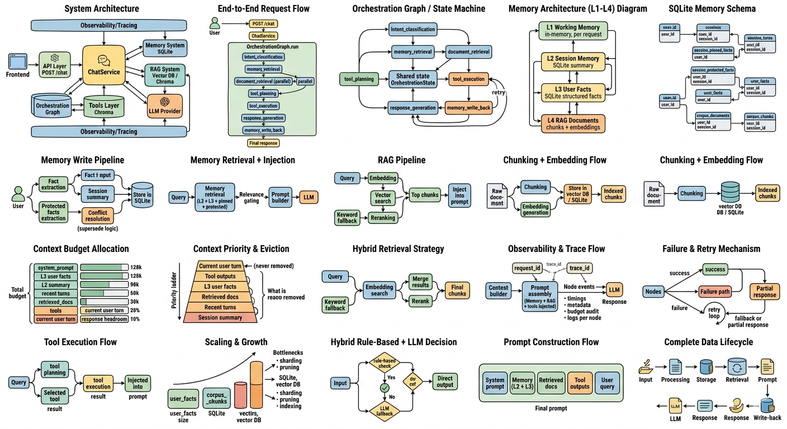

# Project Chronos: Multi-Layered LLM Orchestration & Memory System



## 1. System Abstract
Project Chronos is a production-grade LLM (Large Language Model) orchestration framework designed to move beyond the "stateless chatbot" paradigm. It implements a **deterministic-first, hybrid-memory pipeline** that ensures long-lived conversational persistence, grounded document retrieval (RAG), and rigorous context budget management.

The system is built on the principle that production AI should be **observable, auditable, and cost-controlled**. By utilizing an orchestration graph, Chronos isolates failure domains, parallelizes I/O-heavy retrieval tasks, and enforces a strict priority-based context eviction policy.

---

## 2. Key Architectural Pillars

### Multi-Layered Memory (L1–L4)
Unlike standard implementations that rely on raw chat history, Chronos utilizes a four-tier memory architecture to balance speed, persistence, and accuracy:
* **L1 (Working):** Transient, per-request state (orchestration state).
* **L2 (Session):** SQLite-backed lossy compression (summaries) and lossless "protected facts."
* **L3 (User):** Structured, long-term user profile facts with conflict resolution and TTL.
* **L4 (Corpus):** Document-level RAG stored via vector embeddings (Chroma/In-memory) and keyword indices.

### Context Budgeting & Eviction
To solve the "context window overflow" and token waste problem, the system uses a **Priority-Ladder Eviction Strategy**. Before the LLM is called, the `ContextBuilder` calculates token weights and preserves high-value information (like tool outputs and the current query) while gracefully degrading low-value information (like old chat turns or broad summaries).

### Hybrid Orchestration Graph
The execution flow is governed by a state-machine graph:
1.  **Intent Classification:** Deterministic rules + LLM fallback to route the request.
2.  **Parallel Retrieval:** Concurrent L2/L3 memory hydration and L4 RAG document fetching.
3.  **Tool Execution:** Isolated execution nodes to prevent tool-side failures from crashing the pipeline.
4.  **Response Generation:** Memory-gated prompt construction with budget auditing.
5.  **Memory Write-back:** Asynchronous persistence of newly extracted facts and summaries.

---

## 3. Technical Specifications

### Core Stack
| Component | Implementation |
| :--- | :--- |
| **Language** | Python 3.10+ |
| **Orchestrator** | Custom State-Machine Graph (`graph.py`) |
| **Persistence** | SQLite (Structured), ChromaDB (Vector) |
| **Embeddings** | HuggingFace `all-MiniLM-L6-v2` |
| **Concurrency** | `ThreadPoolExecutor` for parallel I/O |
| **API** | FastAPI / JSON Schema |

### Memory Schema & Persistence
The system uses a normalized SQLite schema (`memory.db`) to ensure multi-tenant isolation and session scoping. Key tables include:
* `user_facts`: Canonicalized key-value storage (e.g., `risk_tolerance: low`).
* `session_protected_facts`: High-fidelity data points immune to summary compression.
* `corpus_chunks`: Document fragments with associated vector IDs.

---

## 4. Retrieval & RAG Strategy
Chronos employs a **Hybrid Retrieval Strategy** to ensure high recall and precision:
1.  **Semantic Search:** Vector-based lookup for conceptual matches.
2.  **Keyword Fallback:** Lexical overlap recovery for technical terms or specific identifiers.
3.  **Reranking:** A lightweight scoring layer to de-duplicate and prioritize chunks based on query-term coverage.


---

## 5. Observability & Reliability
Every request generates a comprehensive **Trace Audit**, allowing developers to reconstruct the exact prompt sent to the model.
* **Request/Trace IDs:** End-to-end tracking from HTTP entry to LLM exit.
* **Budget Audit:** A JSON breakdown of how many tokens each context section (Facts, RAG, Tools) consumed.
* **Selective Retries:** Configurable retry logic specifically for non-deterministic nodes (LLM calls) while keeping deterministic nodes fast.

---

## 6. Design Decisions (ADR Highlights)
* **Why a Graph?** To support selective retries and parallelize retrieval, which reduces total latency by roughly 30-40% compared to sequential execution.
* **Why Rule-Based Extraction?** Critical user identity data (Name, Age, ID) is extracted via deterministic patterns first. This reduces hallucination risk and saves LLM costs on simple data-entry tasks.
* **Deterministic-First Routing:** I prioritize hard-coded intent rules. An LLM should only decide where a request goes when the intent is truly ambiguous.

---

## 7. Local Setup & Production Scaling
### Run backend
```bash
# Install dependencies
pip install -r requirements.txt

# Launch the service
uvicorn app.main:app --reload
```
### Frontend Setup
```bash
cd frontend/cognitive-canvas
```

## Seed Data Setup

### Location
`scripts/seed_data.py`

### Usage
```bash
python scripts/seed_data.py
```

### What it does
- Creates a demo user (`u_demo`)
- Initializes a demo session (`s_demo`)
- Adds sample user facts (L3): name, age, risk tolerance, interest
- Adds sample session conversation turns and summary (L2)
- Indexes a sample policy document for RAG (L4) as `policy_demo`

The script is idempotent and uses existing service APIs from the app container.

### How to test after seeding
Send a chat request:

```json
{
	"user_id": "u_demo",
	"session_id": "s_demo",
	"message": "What do I like?"
}
```

Expected answer:

```text
You enjoy football.
```

#### Install dependencies (first time only)
```bash
npm install
```


#### Run development server
```bash
npm run dev
```

### Scaling Considerations
* **Memory Growth:** For large-scale deployments, `user_facts` are designed to be sharded by `user_id`.
* **Model Agnosticism:** The `generate.py` node is centralized; switching from GPT-4 to a local Llama-3 instance requires only a configuration update in the `LLMClient`.

---
> **Contact / Research:** For inquiries regarding the orchestration logic or memory retrieval benchmarks, please open an issue or refer to the `docs/` directory.